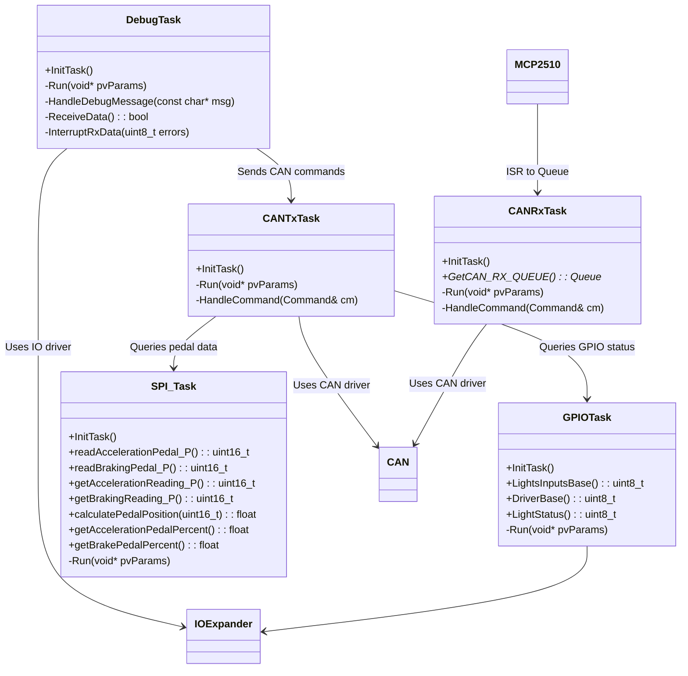

# B3 Board Reference

## Task Diagram

```mermaid
classDiagram
    class CANRxTask {
        +InitTask()
        +GetCAN_RX_QUEUE() : Queue*
        -Run(void* pvParams)
        -HandleCommand(Command& cm)
    }

    class CANTxTask {
        +InitTask()
        -Run(void* pvParams)
        -HandleCommand(Command& cm)
    }

    class DebugTask {
        +InitTask()
        -Run(void* pvParams)
        -HandleDebugMessage(const char* msg)
        -ReceiveData() : bool
        -InterruptRxData(uint8_t errors)
    }

    class GPIOTask {
        +InitTask()
        +LightsInputsBase() : uint8_t
        +DriverBase() : uint8_t
        +LightStatus() : uint8_t
        -Run(void* pvParams)
    }

    class SPI_Task {
        +InitTask()
        +readAccelerationPedal_P() : uint16_t
        +readBrakingPedal_P() : uint16_t
        +getAccelerationReading_P() : uint16_t
        +getBrakingReading_P() : uint16_t
        +calculatePedalPosition(uint16_t) : float
        +getAccelerationPedalPercent() : float
        +getBrakePedalPercent() : float
        -Run(void* pvParams)
    }

    class MCP2510

    DebugTask --> CANTxTask : Sends CAN commands
    DebugTask --> IOExpander : Uses IO driver
    MCP2510 --> CANRxTask : ISR to Queue

    CANTxTask --> GPIOTask : Queries GPIO status
    CANTxTask --> SPI_Task : Queries pedal data
    CANTxTask --> CAN : Uses CAN driver

    CANRxTask --> CAN : Uses CAN driver

    GPIOTask --> IOExpander
```

## Task Descriptions

